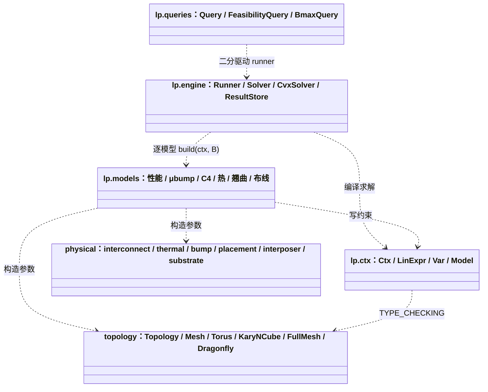
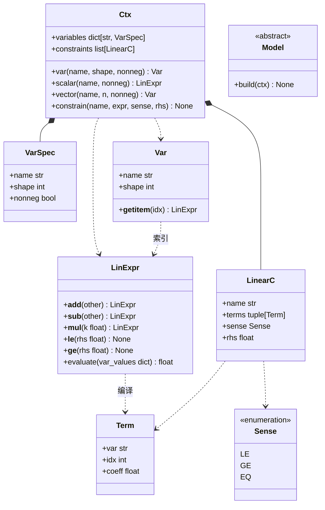
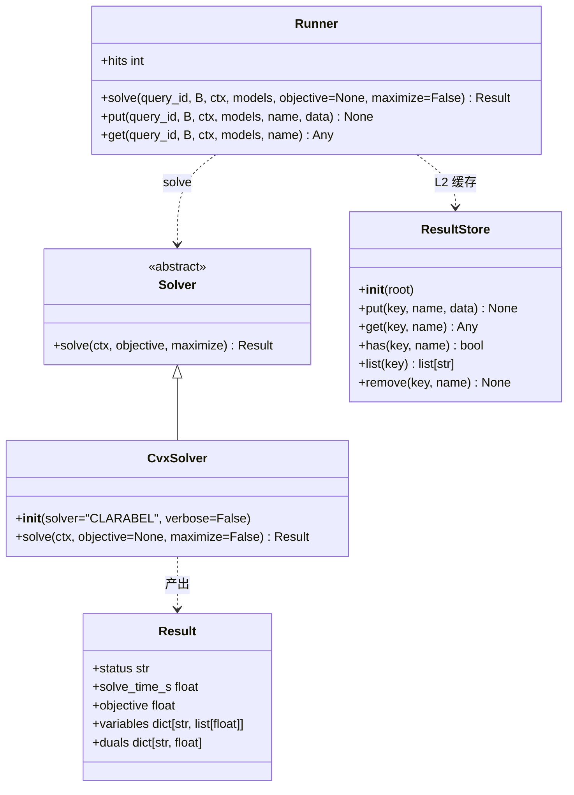
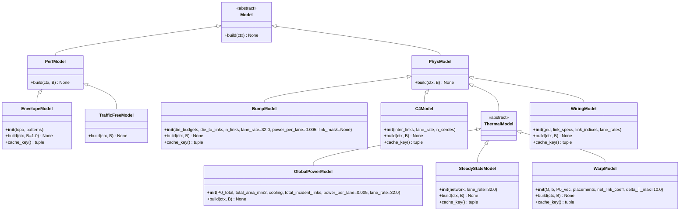
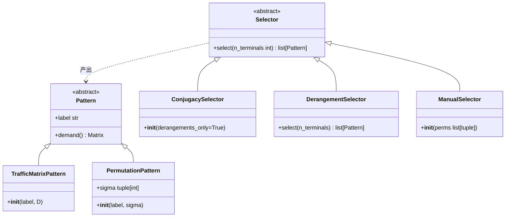
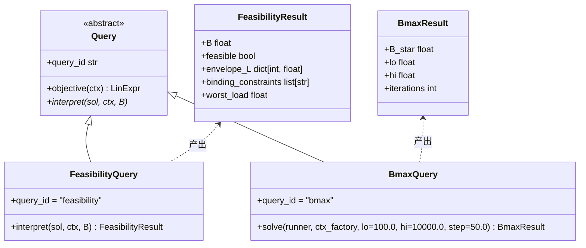
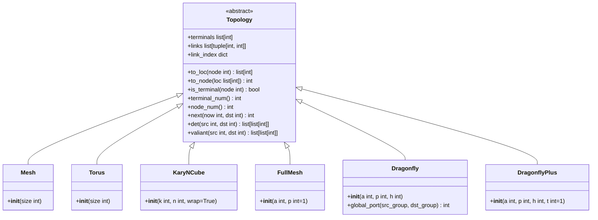
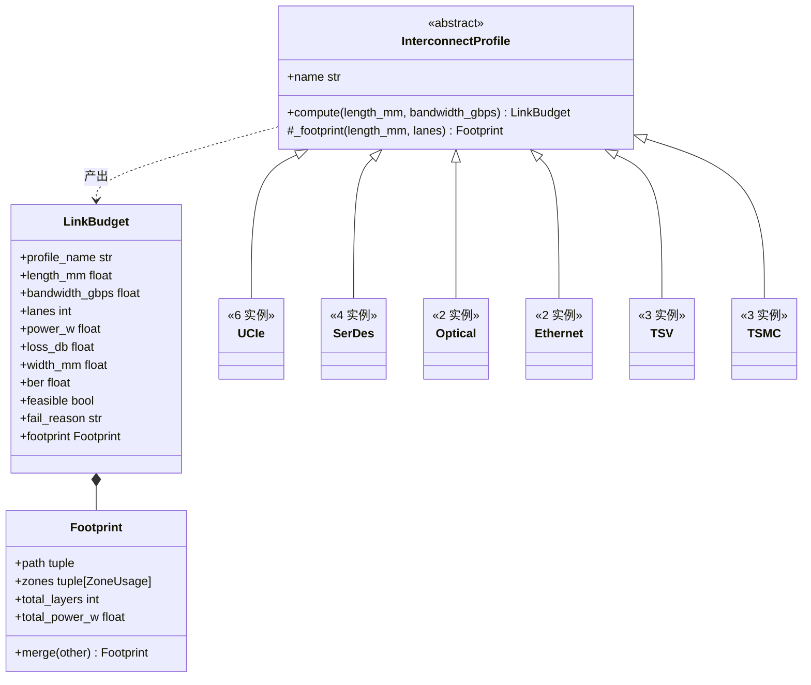
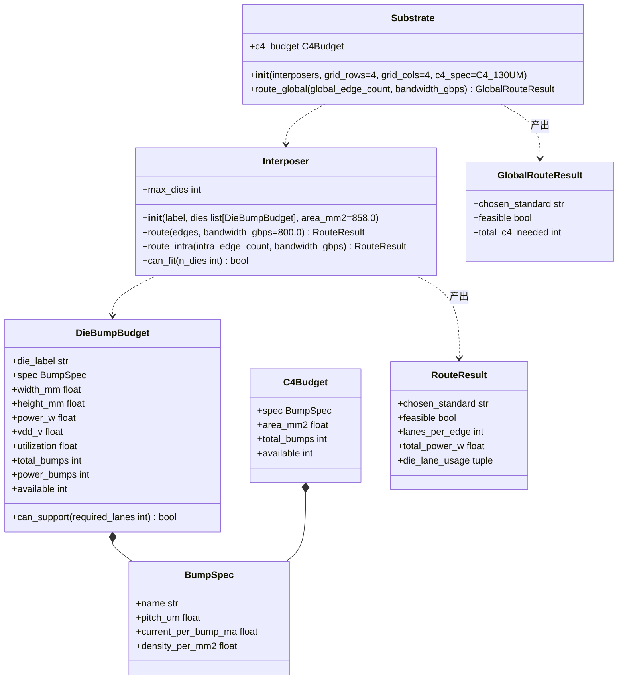

# 接口设计文档

> 状态：2026-08-13，基于当前工作区代码（V2 LP 引擎重构后）。
> UML 用 Mermaid 类图，VSCode 预览 / GitHub 均可渲染。
> 只记接口契约，不记实现与数学推导（数学见 `MATH_MODEL_COMPLETE_V4.md`）。

## 1. 总体架构

六层，单向依赖，无环：

```
queries（查询模式：feasibility / bmax）
   ↓
engine（Runner 编排 + Solver 求解 + ResultStore 缓存）
   ↓
models（约束模型：性能 / μbump / C4 / 热 / 翘曲 / 布线）
   ↓
ctx（LP 构造语言：Ctx / LinExpr / Var / Model）
   ↓  ← TYPE_CHECKING / 构造参数
topology + physical（拓扑与物理库，被 models 引用，不反向 import）
```



---

## 2. lp.ctx —— LP 构造语言

唯一入口是 `Ctx`。表达式算术 → 约束自动注册；`Model` 是约束模型的基类。



### Ctx —— 问题构造上下文（[src/lp/ctx/__init__.py](src/lp/ctx/__init__.py)）

| 接口 | 签名 | 说明 |
|------|------|------|
| `var` | `(name: str, shape: int = 1, nonneg: bool = True) -> Var` | 声明变量；同名重复报 ValueError |
| `scalar` | `(name: str, nonneg: bool = True) -> LinExpr` | 单变量表达式 |
| `vector` | `(name: str, n: int, nonneg: bool = True) -> Var` | 向量变量 |
| `__getitem__` | `(name: str) -> Var` | `ctx["L"]` 引用已声明变量 |
| `constrain` | `(name: str, expr, sense: str, rhs: float = 0.0) -> None` | 写一条约束；sense ∈ `"<="` / `">="` / `"=="`，非法抛 ValueError |
| `variables` | `-> dict[str, VarSpec]` | 只读，Engine 编译用 |
| `constraints` | `-> list[LinearC]` | 只读，Engine 编译用 |

### LinExpr / Var —— 表达式算术（[src/lp/ctx/_expr.py](src/lp/ctx/_expr.py)）

- `LinExpr` 不可变；**操作符重载（`__le__`/`__ge__`）已删除**——写约束的唯一方式是显式 `ctx.constrain(name, expr, sense, rhs)`，约束名是诊断语义的唯一来源。
- 加常数非 0 抛 TypeError（线性项只允许变量）。`evaluate(var_values)` 不建 LP，直接数值求值。
- `Var[idx]`、`Var[list]`、`iter(Var)` 返回 `LinExpr`，支持 `sum()`。

### Model —— 约束模型基类（[src/lp/ctx/_model.py](src/lp/ctx/_model.py)）

```python
class Model(ABC):
    @abstractmethod
    def build(self, ctx: Ctx) -> None: ...
```

⚠️ **声明与使用不一致**：ABC 只声明 `build(ctx)`，但 `Runner` 统一按 `m.build(ctx, B)` 调用。所有模型实际实现两参版本（PerfModel 接受但忽略 B）。见 §8。

---

## 3. lp.engine —— 求解编排



| 模块 | 关键契约 |
|------|----------|
| `Solver`（[solution/__init__.py](src/lp/engine/solution/__init__.py)） | 抽象：`solve(ctx, objective=None, maximize=False) -> Result`。`Result` 是 engine→query 的唯一数据契约 |
| `CvxSolver`（[_cvx.py](src/lp/engine/solution/_cvx.py)） | 唯一 import cvxpy 的文件；默认 CLARABEL，失败自动降级默认求解器 |
| `ResultStore`（[store/__init__.py](src/lp/engine/store/__init__.py)） | 基于目录；key 目录 = sha256(str(key))[:12]；get 校验版本+大小+sha256，损坏返回 None |
| `Runner`（[_runner.py](src/lp/engine/_runner.py)） | 流程：L1 内存缓存 → L2 磁盘缓存 → 逐模型 `m.build(ctx, B)` → `engine.solve(...)` → 存盘 |

**缓存 key**：`(query_id, B, *[m.cache_key() for m in models])`。
⚠️ 任一模型无 `cache_key()` → 该次求解**整体禁用缓存**（见 §8 问题 2）。

---

## 4. lp.models —— 约束模型族

### 4.1 继承层级



**分层语义**：
- `PerfModel.build(ctx, B)` 与 B 无关（路由只由拓扑决定），接受参数但忽略。
- `PhysModel.build(ctx, B)` 与 B 相关：B 越大物理约束越紧。

### 4.2 各模型接口

| 模型 | 构造参数 | B 缩放方式 | cache_key |
|------|----------|-----------|-----------|
| `EnvelopeModel` | `topo: Topology, patterns: list[Pattern]`（空抛 ValueError） | 无（perf 语义） | `("perf", labels, n_links)` |
| `BumpModel` | `die_budgets: list[DieBumpBudget \| None], die_to_links: dict[int, list[int]], n_links: int, lane_rate=32.0, power_per_lane=0.005, link_mask=None` | `B * Σ coeff·L[e] <= rhs` | `("bump_v2", coeffs, rhs)` |
| `C4Model` | `inter_links: list[int], lane_rate, n_serdes: int` | `B * expr <= n_serdes` | `("c4", coeffs, available)` |
| `GlobalPowerModel` | `P0_total, total_area_mm2, cooling: CoolingSolution, total_incident_links, power_per_lane=0.005, lane_rate=32.0` | `(coeff·B)·ΣL <= max_power − P0` | ❌ **缺失** |
| `SteadyStateModel` | `network: ThermalNetwork`（无 lane_rate——link_coeff 已归一化 K/Gbps） | `B·link_coeff·L <= rhs_ambient[i]` | `("therm_l1", coeff bytes, rhs bytes)` |
| `WarpModel` | `G, b, P0_vec, placements, net_link_coeff, delta_T_max=10.0` | `coeffs·B·L <= rhs[i]` | `("warp_v2", coeff bytes, rhs bytes)` |
| `WiringModel` | `grid: WiringGrid, link_specs: list[dict], link_indices: list[int], lane_rates` | `Σx = (B/lane_rate)·L[li]` + 容量约束 | `("wiring_v1", ...)` |

**惯例（STYLE）**：`__init__` 预计算全部系数；`build()` 只做 B 缩放和写约束；`cache_key()` 返回可哈希元组。
唯一例外：`EnvelopeModel` 的 paths/link_incidence 在 `build()` 内动态算，docstring 声明是有意为之。

### 4.3 热模型支撑类型（[therm/](src/lp/models/phys/therm/)）

```mermaid
classDiagram
    class ThermalNetwork {
        +G_inv ndarray
        +rhs_ambient ndarray
        +link_coeff ndarray
    }
    class DiePlacement {
        +id str
        +x float
        +y float
        +w float
        +h float
    }
    class MfitStackConfig {
        +k_interposer float
        +t_interposer float
        +R_vert float
        +T_ambient float
    }
    class build_thermal_network {
        (G, b, T_max, node_links, n_links, power_per_lane, lane_rate, P0_vec) ThermalNetwork
    }
    class build_thermal_system {
        (placements, stack) tuple[G, b]
    }
    class plot_temperature {
        (placements, G, P_watts, b_vec, T_max, T_ambient) Figure
    }
```

- `build_thermal_network(G, b, T_max, node_links, n_links, power_per_lane=0.005, lane_rate=32.0, P0_vec=None) -> ThermalNetwork`：G⁻¹ 等全部预计算。
- `build_thermal_system(placements: list[DiePlacement], stack: MfitStackConfig) -> (G, b)`：G 为对角占优 M-矩阵。
- ⚠️ `WarpModel` 定义于 [_warp_limit.py](src/lp/models/phys/therm/_warp_limit.py) 但**未在 `therm/__init__.py` 导出**——公开 API 里没有它，测试里在用。

### 4.4 布线模型（[wiring/](src/lp/models/phys/wiring/)）

```mermaid
classDiagram
    class WiringGrid {
        +n_vertices int
        +n_edges int
        +edge_cap ndarray
        +vert_cap ndarray
        +edges list[tuple]
        +die_vertex dict[int, int]
        +c4_vertices list[int]
        +c4_pad_cap ndarray
        +path_groups list
    }
    class build_wiring_grid {
        (placements, interposer_w_mm, interposer_h_mm, metal_layers=4, lanes_per_mm=200.0, c4_pitch_mm=0.5, vert_cap_factor=0.8) WiringGrid
    }
    class populate_paths {
        (grid, link_specs) WiringGrid
    }
    class make_wiring_model {
        (placements, link_specs, link_indices, lane_rates, ...) WiringModel
    }
    class WiringModel
```

- `make_wiring_model(...)` 是一站式构建器（含 c4 pad 就近自动指派）。
- backward compat 别名：`RoutingModel = WiringModel`、`RoutingGrid`、`make_routing_model`、`build_routing_grid`。

### 4.5 流量模式与选择器（[perf/traffic_based/traffic/](src/lp/models/perf/traffic_based/traffic/)）



- `PermutationPattern` 冻结可哈希；`DerangementSelector` 在 n>8 抛 ValueError。
- 入口函数：`select_representatives(topo=None, n_terminals=4, derangements_only=True, max_reps=30, selector=None) -> list[Pattern]`，默认用 ConjugacySelector，超 max_reps 截断。Aut(G) 轨道替换 S_n 近似是 TODO。
- 别名：`TrafficMatrix = TrafficMatrixPattern`、`PermutationRep = PermutationPattern`、`SConjugacyReps = ConjugacySelector`、`AllDerangements = DerangementSelector`。

---

## 5. lp.queries —— 查询模式



**调用模式（query 不直接碰 engine）**：

```python
sol = runner.solve(FeasibilityQuery.query_id, B, ctx, models)
result = FeasibilityQuery().interpret(sol, ctx, B)

bmax = BmaxQuery().solve(runner, ctx_factory, lo=100.0, hi=10000.0)
# ctx_factory(B) -> Ctx | tuple[Ctx, list[Model]]
```

- bmax 内部用 `"feasibility"` 作为 query_id 反复调 runner，**两者共享缓存**。
- `partition_bmax = BmaxQuery().solve` 绑定方法别名。

---

## 6. topology —— 拓扑层



| 拓扑 | 构造 | 备注 |
|------|------|------|
| `Mesh` | `(size)` | 2D 网格，全 terminal，维序先 y 后 x |
| `Torus` | `(size)` | 坐标取模，每维最短环绕 |
| `KaryNCube` | `(k, n, wrap=True)` | 默认 wrap=True（即默认 Torus 语义） |
| `FullMesh` | `(a, p=1)` | a 个 die 全互连，每 die p 终端；`valiant` 只枚举中间 router |
| `Dragonfly` | `(a, p, h)` | g=a·h+1 组；`valiant` 只枚举中间 group 的全局 router（性能关键） |
| `DragonflyPlus` | `(a, p, h, t=1)` | ⚠️ 骨架占位：核心方法全部 NotImplementedError |

**接口语义**：
- `to_loc`/`to_node` 坐标互转；`next(now, dst)` 单步维序路由。
- `det(src, dst)` 确定性唯一路径，超过 node_num×4 步不收敛抛 RuntimeError。
- `valiant(src, dst)` = det + 经所有中间 terminal 中转（`_unique_paths` 去重）；Dragonfly/FullMesh 有窄化覆写。
- `links` 是函数式派生（遍历 terminal pair 收集），非构造时预存。
- ⚠️ 没有 Node/Link 类：`NodeId`/`Pair` 只是 [types.py](src/topology/types.py) 里的类型别名；无度/邻居/距离查询方法。

---

## 7. physical —— 物理层

### 7.1 interconnect —— 互连标准注册表



**核心契约**：每种标准是 `InterconnectProfile` 的一个**注册实例**（非类）。

| 接口 | 签名 |
|------|------|
| `compute` | `(length_mm: float, bandwidth_gbps: float) -> LinkBudget`（lanes = ⌈B/R⌉，超 max_reach → feasible=False） |
| `register` | `(std: InterconnectProfile) -> None` |
| `get_profile` | `(name: str) -> InterconnectProfile`（未注册抛 KeyError） |
| `list_profiles` | `() -> list[str]` |

已注册 20 个实例：UCIe ×6（12/16/24/32G-Advanced、8/16G-Standard）、SerDes ×4（112G-VSR/MR/LR、224G-VSR）、Optical ×2（1.6T-8λ、3.2T-16λ）、Ethernet ×2（800G、1.6T）、TSV ×3（9/5/1μm）、TSMC 晶圆级 ×3（InFO-SoW、SoW-X-LSI、SoW-X-SerDes）。
import `physical.interconnect` 即触发全部注册（`__init__.py` 侧挂）。

### 7.2 thermal —— 热求解器

```mermaid
classDiagram
    class ThermalConfig {
        +die_width_mm float
        +die_height_mm float
        +die_count int
        +die_power_w float
        +interposer_area_mm2 float
        +interposer_count int
        +cooling CoolingSolution
        +powers list[float]
        +t_junction_max_k float
        +total_power_w float
    }
    class CoolingSolution {
        +name str
        +max_power_density_w_per_mm2 float
        +max_power(area_mm2) float
    }
    class ThermalResult {
        +feasible bool
        +solver_name str
        +max_temperature_k float
        +avg_temperature_k float
        +margin_k float
        +temperatures list[float]
        +r_eff float
        +fallback bool
    }
    class ThermalSolver {
        <<abstract>>
        +name str
        +solve(config ThermalConfig) ThermalResult
        +calibrate(config, force) float
        +is_calibrated bool
        +r_eff float
    }
    class create_solver {
        (kind="auto", sim_config=None, wafer_config=None) ThermalSolver
    }
    ThermalSolver ..> ThermalResult : 产出
    ThermalSolver ..> ThermalConfig : 输入
    ThermalConfig *-- CoolingSolution
```

| 求解器 | kind | 特点 |
|--------|------|------|
| `_SimpleSolver` | `"simple"` | 功率密度检查；需 cooling 非 None；fallback=True |
| `_MfitSolver` | `"mfit"` | MFIT 3D RC；`available` 探测 numpy/scipy + C 库；不可用自动回退 simple |
| `_HierarchicalSolver` | `"hierarchical"` | 标定 R_eff 后分层求解；`solve` 前必须 `calibrate()` 否则 RuntimeError；另有 `solve_uniform` / `hotspot_report` |

- `create_solver("auto")` = MFIT 可用选 hierarchical，否则 simple。
- 冷却预设：`AIR_COOLING`(0.5) / `LIQUID_COOLING`(2.0) / `IMMERSION`(5.0) / `MICROFLUIDIC`(10.0) W/mm²。
- `thermal/__init__.py` 对 `ThermalSolver`/`create_solver` 用 `__getattr__` 延迟导入（MFIT 依赖重）。

### 7.3 bump / interposer / substrate —— 封装互联



- 核心方程：N_signal + N_power ≤ N_total = η·A/pitch²。
- `Interposer.route(edges: list[(src, dst, L_e)], bandwidth_gbps)`：按 lane_rate 降序尝试全部 `UCIe-*-Advanced`，per-die 检查 `die_lanes[i] ≤ die.available`。
- `Substrate.route_global`：固定 `SerDes-112G-MR`，检查 C4 预算（total_c4 = edges×lanes×2）。
- bump 预设：`UBUMP_25UM`/`UBUMP_45UM`/`C4_130UM`/`HYBRID_9UM`/`HYBRID_5UM`/`HYBRID_1UM`。

### 7.4 placement —— 布局层

```mermaid
classDiagram
    class DieSpec {
        +label str
        +side_mm float
        +group_id int
        +router_id int
    }
    class PlacementProblem {
        +die_side_mm float
        +interposer_side_mm float
        +die_count int
        +edges list[tuple[int, int]]
    }
    class DiePosition {
        +spec DieSpec
        +row int
        +col int
        +x float
        +y float
    }
    class PlacementSolution {
        +positions list[DiePosition]
        +grid_n int
        +n_dies int
        +max_dies int
        +die_at(row, col) DiePosition
        +summary() str
    }
    class solve_grid_placement {
        (problem PlacementProblem) PlacementSolution
    }
    class plot_placement {
        (solution, title, save_path) Figure
    }
    PlacementProblem *-- DieSpec
    PlacementSolution *-- DiePosition
    PlacementProblem ..> PlacementSolution : 求解
```

- 当前求解器：逐行填充，feasible-only。`edges` 字段预留给拓扑感知求解器（链路多的 die 对放相邻），**尚未接线**。

---

## 8. 跨层协议与已知不一致

### 隐式协议（代码依赖但未写入 ABC）

| 协议 | 要求 | 风险 |
|------|------|------|
| `build(ctx, B)` | Runner 统一两参调用 | `Model` ABC 只声明 `build(ctx)`，接口与实现脱节 |
| `cache_key() -> tuple \| None` | 可哈希元组；None 降级 | 不是 abstractmethod，遗漏只有运行时才知道 |
| `__init__` 预计算 / `build()` 只缩放 | STYLE 惯例 | 非强制 |

### 约束命名协议（2026-08-13 起）

每个模型家族的约束名带前缀，绑定诊断按前缀归类：`r{r}_flow_p{pi}` / `r{r}_load_e{e}` / `r{r}_env_e{e}`（性能）、`bump_{die_label}`、`c4`、`therm_l0` / `therm_d{i}`、`warp_{i}`、`route_dem/edge/vert/c4pad`（布线）。

### 已知不一致（写文档时发现）

1. **`Model.build(ctx)` 签名**：ABC 单参，实际全部两参。要么 ABC 改成 `build(ctx, B)`，要么 Runner 改调用方式——先定，再改（论文一致原则）。
2. **`GlobalPowerModel` 缺 `cache_key()`**：与其它模型混用时 Runner 对该次求解整体禁用缓存，且失败无声。
3. **`WarpModel` 有意不导出**（2026-08-13 决定）：实现与 test0402 保留作技术记录，但已移出论文约束集（die-die 温差代理撑不起真实翘曲物理，ΔT_max 缺文献）。见 archive/MATH_MODEL_COMPLETE_V3.md §3.5 状态注（V4 无此约束）。
4. **骨架占位**：`TrafficFreeModel`（build 抛 NotImplementedError）、`DragonflyPlus`（核心方法全抛 NotImplementedError）——接口存在但不可用，调用方无法从签名区分。
5. **`EnvelopeModel` 偏离预计算惯例**：paths/link_incidence 在 build() 内动态算，docstring 声明有意为之——接口文档保留原样，标记为唯一例外。
6. **duals 提取三个坑**：①无目标（feasibility）求解 CLARABEL 可能不返回 duals——绑定诊断必须用 min ΣL 解（见 test08 §1e）；②`_cvx.py` 按 `enumerate(prob.constraints)` 索引对齐 `ctx.constraints[i].name`，依赖 cvxpy 不重排约束——当前实测保序，但这是脆弱假设；③feasible=False 时 duals 是 Farkas 证书，不是绑定约束；④min ΣL 解处只有活跃约束有 dual——"B 再涨谁先碰壁"要看账本 margin（rhs−lhs 的最小者），duals 回答的是"流量再大谁挡路"。
7. **约束签名（2026-08-13）**：`constrain(name, lhs, sense, rhs, meaning="")`——lhs/rhs 都收 LinExpr；不等式必须给 meaning（取等号的物理含义），缺了 ValueError；操作符重载已删除。
8. **已修的隐患**：`SteadyStateModel` 曾带 `lane_rate` 参数，与 `build_thermal_network` 已归一化的 link_coeff 双重除法，热约束失效 32×——参数已删，scale 恒为 B。
